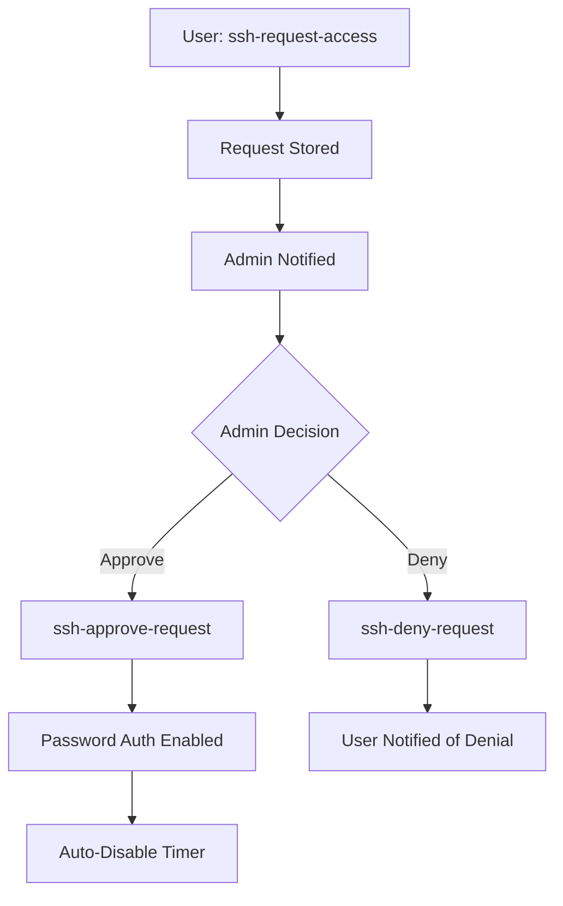
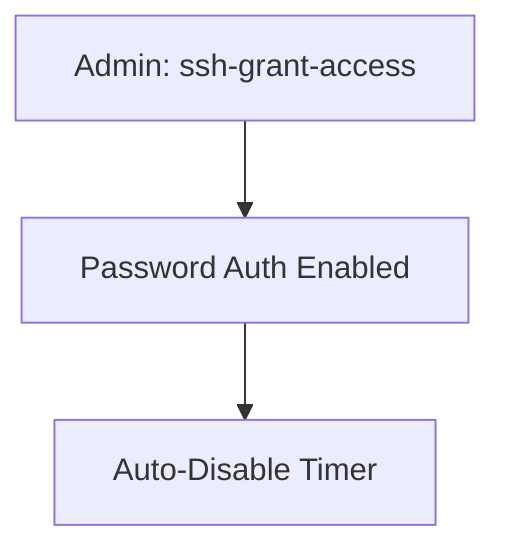

# SSH Server Manager

A comprehensive SSH server management system with request-based access control, providing secure and auditable temporary password authentication.

## Overview

The SSH Server Manager provides a complete workflow for managing SSH access requests and temporary password authentication. It replaces the old confusing system with clear, well-named commands and proper approval workflows.

## Architecture

### New Command Structure

| Command | Purpose | Who Uses It |
|---------|---------|-------------|
| `ssh-request-access` | Request temporary SSH access | End users |
| `ssh-approve-request` | Approve access requests | Administrators |
| `ssh-deny-request` | Deny access requests | Administrators |
| `ssh-list-requests` | View all requests | Administrators |
| `ssh-grant-access` | Direct access grant (emergency) | Administrators |
| `ssh-cleanup-requests` | Clean up old requests | Administrators |

### Workflow Types

#### 1. Request/Approval Workflow (Recommended)


#### 2. Direct Grant Workflow (Emergency)


## Commands Reference

### User Commands

#### ssh-request-access
Request temporary SSH password access.

```bash
ssh-request-access USERNAME REASON [DURATION]
```

**Examples:**
```bash
ssh-request-access fr4iser "Need to copy SSH keys"
ssh-request-access john "Emergency server maintenance" 600
```

**Features:**
- Creates JSON request record with unique ID
- Sends notifications to administrators
- Auto-cleanup of old requests
- Audit trail for compliance

### Administrator Commands

#### ssh-approve-request
Approve a pending access request.

```bash
ssh-approve-request REQUEST_ID [CUSTOM_DURATION]
```

**Examples:**
```bash
ssh-approve-request 20250126_101530_fr4iser
ssh-approve-request 20250126_101530_fr4iser 600
```

**Features:**
- Validates request exists and is pending
- Enables password authentication temporarily
- Updates request status with approval details
- Sends approval notifications
- Auto-disable timer

#### ssh-deny-request
Deny a pending access request.

```bash
ssh-deny-request REQUEST_ID REASON
```

**Examples:**
```bash
ssh-deny-request 20250126_101530_fr4iser "Use VPN instead"
ssh-deny-request 20250126_101530_fr4iser "Security policy violation"
```

#### ssh-list-requests
View and manage access requests.

```bash
ssh-list-requests [STATUS]
```

**Status Options:**
- `all` - Show all requests (default)
- `pending` - Show only pending requests
- `approved` - Show only approved requests
- `denied` - Show only denied requests
- `expired` - Show only expired requests

**Examples:**
```bash
ssh-list-requests
ssh-list-requests pending
ssh-list-requests approved
```

#### ssh-grant-access
Directly grant temporary SSH access (emergency use).

```bash
ssh-grant-access USERNAME [DURATION] [REASON]
```

**Examples:**
```bash
ssh-grant-access fr4iser
ssh-grant-access fr4iser 600 "Emergency server maintenance"
ssh-grant-access john 120 "Quick key setup"
```

**Use Cases:**
- Emergency situations
- When request/approval workflow is too slow
- Direct administrative action needed

#### ssh-cleanup-requests
Clean up old request files.

```bash
ssh-cleanup-requests [DAYS]
```

**Examples:**
```bash
ssh-cleanup-requests     # Clean up requests older than 7 days
ssh-cleanup-requests 30  # Clean up requests older than 30 days
```

## Request Storage

Requests are stored as JSON files in `/var/log/ssh-requests/` with the following structure:

```json
{
  "id": "20250126_101530_fr4iser",
  "user": "fr4iser",
  "reason": "Need to copy SSH keys",
  "duration": 300,
  "timestamp": "2025-01-26T10:15:30+01:00",
  "status": "pending",
  "requester_ip": "192.168.1.100",
  "hostname": "server.example.com"
}
```

### Status Lifecycle

1. **pending** - Initial state when request is created
2. **approved** - Admin approved the request
3. **denied** - Admin denied the request
4. **expired** - Approved request has expired

## Notifications

The system supports multiple notification types:

### Email Notifications
- Sent to configured admin email addresses
- Includes request details and action commands
- Supports approval/denial notifications

### Desktop Notifications
- Real-time notifications on admin desktops
- Critical priority for new requests
- Normal priority for approvals/denials

### Webhook Notifications
- JSON payloads to configured webhook URLs
- Integration with external systems
- Structured data for automation

## Security Features

### Automatic SSH Config Management
- Backs up SSH config before changes
- Automatically reverts to secure settings
- Prevents permanent security weakening

### Audit Trail
- Complete request lifecycle tracking
- Timestamps for all actions
- IP address logging
- Approval/denial reasons

### Access Controls
- Request validation
- Status checking
- Duplicate prevention
- Auto-cleanup of old requests

## Configuration

### Enable the SSH Server Manager
```nix
{
  features.ssh-server-manager = {
    enable = true;
    
    # Configure notifications
    notifications = {
      enable = true;
      types = {
        email = {
          enable = true;
          address = "admin@example.com";
        };
        desktop = {
          enable = true;
        };
        webhook = {
          enable = true;
          url = "https://hooks.example.com/ssh-requests";
        };
      };
    };
  };
}
```

### Customize Default Settings
```nix
{
  features.ssh-server-manager = {
    request-access = {
      defaultDuration = 300;  # 5 minutes
      maxDuration = 3600;     # 1 hour
    };
    
    grant-access = {
      defaultDuration = 300;  # 5 minutes
      maxDuration = 3600;     # 1 hour
    };
    
    list-requests = {
      defaultCleanupDays = 7;
      maxDisplayRequests = 50;
    };
  };
}
```

## Migration from Old System

### Old vs New Commands

| Old Command | New Command | Notes |
|-------------|-------------|-------|
| `ssh-open-password` | `ssh-request-access` | Now actually requests access |
| `ssh-temp-access` | `ssh-grant-access` | Renamed for clarity |
| N/A | `ssh-approve-request` | New approval workflow |
| N/A | `ssh-deny-request` | New denial workflow |
| N/A | `ssh-list-requests` | New request management |

### Breaking Changes

1. **ssh-open-password removed** - Use `ssh-request-access` instead
2. **ssh-temp-access renamed** - Use `ssh-grant-access` instead
3. **New approval workflow** - Requests now require explicit approval
4. **Changed default durations** - Now defaults to 5 minutes instead of 1 minute

## Troubleshooting

### Common Issues

#### Request Not Found
```bash
$ ssh-approve-request invalid_id
Error: Request not found: invalid_id
Use 'ssh-list-requests' to see available requests
```

**Solution:** Use `ssh-list-requests` to find the correct request ID.

#### Request Already Processed
```bash
$ ssh-approve-request 20250126_101530_fr4iser
Error: Request 20250126_101530_fr4iser is not pending (status: approved)
```

**Solution:** Check request status with `ssh-list-requests`.

#### SSH Service Restart Failed
```bash
Error: Failed to restart SSH service
```

**Solution:** Check SSH configuration syntax and system logs.

### Logs and Debugging

- SSH service logs: `journalctl -u sshd`
- Request files: `/var/log/ssh-requests/`
- SSH config backups: `/etc/ssh/sshd_config.backup.*`

## Best Practices

### For Users
1. Always provide a clear reason for access requests
2. Request only the minimum duration needed
3. Use the request/approval workflow for non-emergency access

### For Administrators
1. Review requests promptly to avoid blocking users
2. Use descriptive denial reasons
3. Prefer `ssh-approve-request` over `ssh-grant-access` for audit trails
4. Regularly clean up old requests with `ssh-cleanup-requests`
5. Monitor notifications for security awareness

### Security Recommendations
1. Configure notifications to ensure timely request processing
2. Set reasonable maximum durations
3. Regularly audit request logs
4. Use webhook notifications for integration with security systems
5. Train users on proper request procedures

## Integration Examples

### Slack Webhook Integration
```bash
# Configure webhook URL in NixOS config
webhook.url = "https://hooks.slack.com/services/YOUR/SLACK/WEBHOOK";
```

### Email Integration with Multiple Recipients
```nix
{
  features.ssh-server-manager.notifications.types.email = {
    enable = true;
    address = "admin@example.com,security@example.com";
  };
}
```

### Automated Approval (Advanced)
For trusted environments, you can create automated approval scripts that process requests based on predefined criteria.

## Support

For issues or questions about the SSH Server Manager:

1. Check the troubleshooting section above
2. Review system logs for error details
3. Verify configuration settings
4. Test with simple cases first

The new system provides much better error messages and guidance compared to the old system, making troubleshooting easier and more intuitive.
