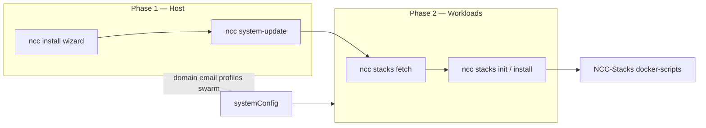

# Stack setup flow — ADR

Status: **accepted**. Phase 1 tasks **implemented** (2026-08-23). Phase 2+ pending.

Related: [USAGE.md](./USAGE.md), [CLI.md](../CLI.md), [GUI-FLEET-BRAINSTORM.md](./GUI-FLEET-BRAINSTORM.md).

---

## Context

Stack deployment spans two lifecycles:

1. **Host / Nix** — users, Docker packages, `stack-manager` module, domain/email in `systemConfig`, Swarm role, rebuild.
2. **Catalog workloads** — which containers run, DNS/DDNS, gateway (Traefik/CrowdSec), compose vs stack files.

The catalog and deploy scripts live in the external **[NCC-Stacks](https://github.com/fr4iser90/NCC-Stacks)** repo. NCC **`stack-manager`** fetches the catalog and invokes `docker-scripts` (`init-homelab.sh`, `init-compute.sh`, `stacks.sh`, `swarm.sh`).

Users today see a fragmented chain: Install wizard → rebuild → `ncc stacks fetch` → `install`/`init`, with duplicate domain prompts and no guided “phase 2” after rebuild.

---

## Decision

**Option C — NCC orchestrates, NCC-Stacks executes.**

| Layer | Owner | Responsibility |
|-------|--------|----------------|
| Host provisioning | `install-wizard` + `systemConfig` | Module enable, users, domain/email, `profiles`, `swarm`, Docker via packages |
| Transport | `stack-manager` | `fetch`, placeholder substitution, CLI/GUI dispatch, Target/fleet chrome |
| Workload engine | NCC-Stacks `docker-scripts` | DNS provider, gateway init, port guidance, service start, compose/stack selection |
| Desktop GUI | NCC `gui-engine` + domain `stacks` page | Cockpit only — **no** Qt GUI inside NCC-Stacks |

Keep **`fetch` → `init` / `install`** as the mechanism. Improve **contract** (env, non-interactive, structured output) and **UX handoff** between phase 1 and phase 2.

**One module** (`stack-manager`) for homelab and compute — differentiated by catalog **profile family**, not separate installer modules.

---

## Two phases (user mental model)



| Phase | Canonical entry | Outcome |
|-------|-----------------|---------|
| **1 — Host** | `ncc install --gui` (Homelab Server preset or blueprint) | `stack-manager.enable`, docker packages, virt user, `domain`/`email`, optional `swarm`, optional `profiles` |
| **2 — Workloads** | `ncc stacks fetch` then `ncc stacks init` or `install --profile …` | Catalog in virt home; `init-homelab.sh` or `init-compute.sh` runs gateway/media/compute services |

Homelab gateway/media and compute GPU boxes share phase 2; they differ only in **profile** (e.g. `homelab-core` vs `compute-llm-arm`).

---

## Profile families (catalog SSOT)

Profiles are YAML in NCC-Stacks `profiles/*.yml`. Examples documented in NCC:

| Profile | Family | Init script | Typical services |
|---------|--------|-------------|------------------|
| `homelab-core` | homelab | `init-homelab.sh` | Traefik+CrowdSec, DDNS, Cloudflare companion, Portainer, Watchtower |
| `homelab-media` | homelab | `init-homelab.sh` | Jellyfin, Plex, Owncast (needs gateway from core) |
| `compute-llm-x86` | compute | `init-compute.sh` | LLM/Whisper/ComfyUI stack (x86) |
| `compute-llm-arm` | compute | `init-compute.sh` | Same family (ARM, e.g. Jetson) |

Live list: `ncc stacks list-profiles [--remote]`.

`ncc stacks install --profile NAME` delegates to `ncc stacks init` with profiles; single services use `ncc stacks install group/service` → `stacks.sh start`.

---

## NCC ↔ engine contract (reuse for similar cases)

Use this pattern whenever NCC orchestrates an **external catalog or script bundle** (stacks today; future: other catalogs, image pipelines, backup targets).

| # | Rule |
|---|------|
| 1 | **Thin adapter in NCC** — one module: fetch, invoke, status, `--json`/`--plain`, GUI page. No duplicated business logic. |
| 2 | **Engine in the specialist repo** — install/deploy/DNS/firewall details only there. |
| 3 | **Config from NCC** — domain, email, profiles, swarm → `systemConfig`; engine reads **env/flags**, not grep of `/etc/nixos`. |
| 4 | **Non-interactive path** — `NCC_NON_INTERACTIVE=1`, `--yes`, `NCC_ASSUME_YES` for GUI and automation. |
| 5 | **Structured output** — list/status commands support machine-readable lines or JSON for GUI. |
| 6 | **GUI only in NCC** — external repo: CLI/TUI/docs; container UIs (Portainer, Traefik) are fine; no desktop Qt in the catalog repo. |
| 7 | **Two wizards max** — host wizard ≠ workload wizard; explicit “after rebuild” next step. |
| 8 | **Declarative intent** — `profiles = [ … ]` on each host = what should run; GUI shows declared vs runtime. |
| 9 | **No legacy aliases** — one canonical CLI path (`ncc stacks`); module path migration via `module-manager`, not parallel GUI/CLI ids. |

NCC already substitutes `{{DOMAIN}}`, `{{EMAIL}}`, etc. in catalog files and exports `DOMAIN`/`EMAIL` before calling init (`handlers/stacks-create.nix`).

---

## GUI policy

| Surface | Role |
|---------|------|
| `ncc install --gui` | Phase 1 — homelab topology, virt user, domain/email, packages |
| `ncc stacks --gui` | Phase 2 — fleet/host/catalog; catalog browse + install; future **first-run setup** wizard on Catalog tab |
| NCC-Stacks shell | Interactive fallback (fzf, DNS provider prompts, router port hints) |

Rejected: standalone Qt/Web GUI inside NCC-Stacks (second cockpit, no Target/fleet integration).

---

## Rejected alternatives

| Alternative | Why not |
|-------------|---------|
| Everything in `ncc install` | Unmaintainable; every new stack would require NCC release + rebuild |
| GUI in NCC-Stacks | Duplicate chrome, SSH/Target, discovery; split release train |
| Separate compute installer module | Same engine (`init-compute.sh`); profiles already separate families |
| Keep duplicate `homelab` CLI/GUI aliases | Migration handles renames; aliases hide broken bookmarks |

---

## Implementation roadmap

### Phase 1 — polish (high value, low risk)

Concrete tasks:

| ID | Task | Repo | Files / notes |
|----|------|------|----------------|
| P1-1 | Write `stack-manager` config from install answers | ✅ `write_stack_manager_config`, GUI + preset `stackManager` |
| P1-2 | Install confirm / finish: phase 2 hint | ✅ wizard confirm + `init.sh` log_next |
| P1-3 | Domain/email without re-prompt | ✅ NCC-Stacks `get_homelab_domain` |
| P1-4 | USAGE links ADR | ✅ |
| P1-5 | Jetson blueprint compute profile | ✅ `fr4iser-jetson-orin` |
| P1-6 | Migration plan covers homelab-manager | ✅ `stack-manager-rename-v1` (no change needed) |

**Done when:** Homelab install path writes `stack-manager`; user is not asked for domain twice; confirm screen states phase 2; one blueprint demonstrates compute profile.

### Phase 2 — guided workloads (medium effort)

| ID | Task |
|----|------|
| P2-1 | NCC-Stacks: `NCC_NON_INTERACTIVE=1` / `--yes` on `init-homelab.sh` / `init-compute.sh` for DNS/gateway steps where safe |
| P2-2 | Stacks GUI: “First run” or Setup dialog — preflight (docker, catalog, virt user) → profile picker → run init with log panel (reuse `run_ncc` / operating scope) |
| P2-3 | Optional GUI fields for DNS provider credentials → write env files then non-interactive init |
| P2-4 | `ncc stacks status --json` includes declared `profiles` from config vs catalog presence |

### Phase 3 — fleet (see GUI-FLEET-BRAINSTORM)

| ID | Task |
|----|------|
| P3-1 | Fleet aggregates declared `profiles` per creds host |
| P3-2 | Optional declarative tags keyed by creds id |
| P3-3 | Cache under `/var/lib/ncc/` for last status JSON |

---

## Command reference (phase 2)

```bash
# Dev: use local clone instead of fetch into virt home
export NCC_STACKS_ROOT=~/Documents/Git/NCC-Stacks

sudo -u <virt-user> ncc stacks fetch
sudo -u <virt-user> ncc stacks list-profiles
sudo -u <virt-user> ncc stacks install --profile homelab-core
# or: ncc stacks init   # uses profiles from systemConfig when no args

# Compute (no gateway path)
sudo -u <virt-user> ncc stacks install --profile compute-llm-arm

# GUI
ncc stacks --gui   # Catalog tab → Install selected
```

---

## Changelog

| Date | Change |
|------|--------|
| 2026-08-23 | Initial ADR — Option C, contract, phased tasks |
