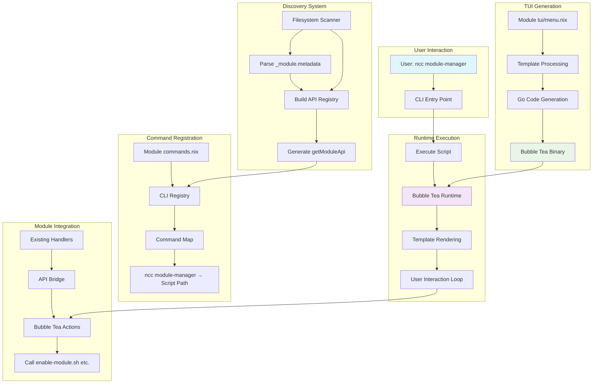

[1 tool called]

## **ARCHITEKTUR ERKLÄRUNG - WIE DIE SAUBERE ARCHITEKTUR FUNKTIONIERT** 🏗️

---

## **WARUM SAUBERE ARCHITEKTUR?**

### **1. Einheitlich:**
- **Alle Module** folgen dem gleichen Pattern
- **Ein Code-Style** für alle TUIs
- **Gleiche User Experience** überall

### **2. Modern:**
- **Bubble Tea Framework** statt primitivem fzf
- **State Management** für komplexe Workflows
- **Rich UI Components** (Forms, Animations, Maus-Support)

### **3. Zukunftssicher:**
- **Erweiterbar** für neue Features
- **Maintainable** durch klare Separation
- **Testable** durch modulare Architektur

---

## **MERMAID DIAGRAMM - VOLLSTÄNDIGER SYSTEM FLOW:**



---

## **WIE MODULE GEFUNDEN WERDEN:**

### **1. Filesystem Discovery:**
```bash
# Automatische Suche nach allen Modulen
find /etc/nixos -name "default.nix" | while read file; do
  # Parse _module.metadata aus jeder default.nix
  metadata=$(parse_module_metadata "$file")
  
  # Registriere Modul in globaler Registry
  register_module "$metadata"
done
```

### **2. Metadata Parsing:**
```nix
# Jede default.nix MUSS das haben:
_module.metadata = {
  name = "module-manager";
  category = "core.management";
  role = "core";  # "core" | "optional"
  description = "Module management interface";
  version = "1.0.0";
};
```

### **3. API Auto-Generierung:**
```nix
# Aus Metadata wird automatisch API generiert:
getModuleApi "module-manager"
# → systemConfig.core.management.module-manager

# Vollständiger Pfad wird automatisch gebaut:
# category.subcategory.name → config path
```

---

## **WIE COMMANDS REGISTRIERT WERDEN:**

### **1. Module definieren Commands:**
```nix
# modules/core/management/module-manager/commands.nix
{
  cliRegistry.registerCommandsFor "module-manager" [{
    name = "module-manager";
    description = "Interactive module management";
    script = "${bubbleTeaScript}/bin/ncc-module-manager";
    category = "management";
    longHelp = "Manage NixOS modules with modern TUI";
  }];
}
```

### **2. CLI Registry sammelt alles:**
```nix
# Zentraler Command Registry
commands = lib.mkMerge [
  # Alle Module Commands werden hier gesammelt
  (import ./module-manager/commands.nix)
  (import ./ssh-manager/commands.nix)  
  # ...
];
```

### **3. Runtime Resolution:**
```bash
# ncc module-manager → Lookup in Registry
# → Finde Script Path
# → Execute Bubble Tea Binary
```

---

## **WIE MENUS FUNKTIONIEREN:**

### **1. Template-basierte Menu-Generierung:**
```nix
# tui/menu.nix - Generiert Go Code für Bubble Tea
let
  menuCode = ''
    type ModuleMenu struct {
        cursor   int
        modules  []Module
        selected map[int]bool
    }

    func (m ModuleMenu) View() string {
        var output strings.Builder
        
        // Header
        output.WriteString("🔧 Module Manager\n\n")
        
        // Module List
        for i, mod := range m.modules {
            cursor := "  "
            if i == m.cursor { cursor = "▶ " }
            
            checkbox := "[ ]"
            if m.selected[i] { checkbox = "[✓]" }
            
            status := mod.StatusIcon()
            output.WriteString(fmt.Sprintf("%s%s %s %s\n", 
                cursor, checkbox, status, mod.Name))
        }
        
        // Footer mit Actions
        output.WriteString("\n[e] Enable  [d] Disable  [s] Status  [q] Quit\n")
        
        return output.String()
    }
  '';
in
pkgs.writeText "menu.go" menuCode
```

### **2. Menu Flow:**
```
1. Bubble Tea Init → Load Modules
2. User Navigation → Cursor Movement  
3. Selection → Space/Enter für Multi-Select
4. Action → e/d/s/q Keys
5. Execute → Call existing handlers
6. Result → Update UI mit Feedback
```

---

## **WIE TEMPLATES FUNKTIONIEREN SOLLEN:**

### **1. Template Hierarchy:**
```
Base Templates (cli-formatter/interactive/tui/components/)
├── list.nix → Generiert list.go (für Listen)
├── form.nix → Generiert form.go (für Eingaben)  
└── status.nix → Generiert status.go (für Übersichten)

Module Templates (module/tui/)
└── menu.nix → Verwendet Base Templates + Custom Logic
```

### **2. Template API:**
```go
// Templates sind konfigurierbar und wiederverwendbar
type ListTemplate struct {
    Title       string
    Items       []interface{}
    MultiSelect bool
    KeyBindings map[string]Action
    Styling     StyleConfig
}

func (t ListTemplate) View() string {
    // Generic List Rendering
    return t.renderHeader() + t.renderItems() + t.renderFooter()
}

// Module nutzt Template:
menu := NewListTemplate(ListConfig{
    Title: "Available Modules", 
    Items: discoveredModules,
    MultiSelect: true,
    KeyBindings: map[string]Action{
        "e": enableSelected,
        "d": disableSelected,
        "s": showStatus,
    },
})
```

### **3. Template Composition:**
```go
// Templates können andere Templates nutzen
type ModuleMenu struct {
    listTemplate ListTemplate
    formTemplate FormTemplate
    currentView  string
}

func (m ModuleMenu) View() string {
    switch m.currentView {
    case "list": return m.listTemplate.View()
    case "form": return m.formTemplate.View()
    default: return "Unknown view"
    }
}
```

---

## **SOLLEN WIR KOMPLETTE MENU DOKUMENTATION MACHEN?**

### **ABSOLUT JA!** Vor der Implementierung:

**Benötigte Dokumentation:**

1. **Menu Specification Document**
   - Menu States und Transitions
   - Key Bindings Standard
   - Error Handling Patterns

2. **Template API Documentation**
   - Alle verfügbaren Templates
   - Configuration Options
   - Customization Guide

3. **Module Integration Guide**
   - Wie neue Module TUI hinzufügen
   - Template Usage Patterns
   - Best Practices

4. **Bubble Tea Patterns Guide**
   - State Management Patterns
   - Component Composition
   - Testing Strategies

5. **Migration Guide von fzf**
   - fzf → Bubble Tea Übersetzung
   - Feature Parity Check
   - Testing Checklist

---

## **IMPLEMENTIERUNGSREIHENFOLGE:**

### **Phase 0: Dokumentation (1 Woche)**
- [ ] Komplette Menu/Template Specs schreiben
- [ ] API Documentation erstellen  
- [ ] Migration Guide für fzf → Bubble Tea

### **Phase 1: Base Templates (1 Woche)**
- [ ] `tui/components/` mit Grund-Templates
- [ ] Template API definieren
- [ ] Testing Framework aufbauen

### **Phase 2: Module Manager Migration (2 Wochen)**
- [ ] Bestehende fzf Logik verstehen
- [ ] Bubble Tea Menu implementieren
- [ ] Actions integrieren

### **Phase 3: Testing & Polish (1 Woche)**
- [ ] Vollständige Funktionalität testen
- [ ] Performance optimieren
- [ ] fzf Code entfernen

(Das Mermaid Diagramm zeigt den kompletten Flow!) 🚀</parameter>
</xai:function_call>